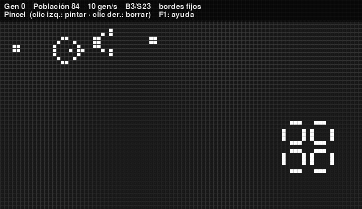

# Juego de la Vida

El autómata celular de John Conway en Python, con [pygame](https://www.pygame.org) y
[NumPy](https://numpy.org), y una [versión web](#versión-web) que funciona en el navegador.



Cada célula de la rejilla está viva o muerta. En cada generación:

- una célula **muerta** con exactamente **3** vecinas vivas **nace**;
- una célula **viva** con **2 o 3** vecinas vivas **sobrevive**; si no, muere.

## Instalación

Requiere Python 3.10 o superior.

```bash
pip install -r requirements.txt
```

## Uso

```bash
./gameoflife.py                  # o: python3 gameoflife.py
./gameoflife.py --patron canon-gosper --columnas 120 --celda 8
./gameoflife.py --aleatorio 0.3 --regla highlife --color-edad
./gameoflife.py --pausado        # empezar en pausa para dibujar
./gameoflife.py --help
```

| Opción | Descripción | Por defecto |
|---|---|---|
| `--columnas N`, `--filas N` | Tamaño de la rejilla | 80 × 60 |
| `--celda PX` | Tamaño de cada celda en píxeles | 12 |
| `--velocidad GEN/S` | Generaciones por segundo | 10 |
| `--regla REGLA` | Regla en notación B/S (`B36/S23`) o un preset (ver [Reglas](#reglas)) | `conway` |
| `--bordes {toroidal,fijos}` | Toroidal: lo que sale por un lado entra por el opuesto. Fijos: fuera de la rejilla todo está muerto | `toroidal` |
| `--patron NOMBRE\|RUTA` | Patrón inicial centrado: nombre de la biblioteca o ruta a un `.rle` | palo + glider |
| `--aleatorio [DENSIDAD]` | Empezar con células al azar | 0.25 |
| `--color-edad` | Colorear las células según cuántas generaciones llevan vivas | no |
| `--pausado` | Empezar en pausa | no |
| `--listar-patrones` | Mostrar los patrones incluidos y salir | |

## Controles

Pulsa **F1** en la ventana para ver esta ayuda.

| Tecla / ratón | Acción |
|---|---|
| `Espacio` | Pausar / reanudar |
| `N` | Avanzar una generación |
| `C` | Limpiar la rejilla |
| `R` | Rellenar al azar |
| `+` / `-` | Más / menos velocidad (1 a 240 gen/s) |
| Clic izquierdo (y arrastrar) | Pintar células |
| Clic derecho (y arrastrar) | Borrar células |
| `1`–`8` / `P` | Elegir un patrón: aparece una vista previa bajo el cursor y un clic lo coloca. `P` los recorre uno a uno |
| `A` | Color según la edad |
| `G` | Líneas de la rejilla |
| `H` | Mostrar / ocultar la barra de información |
| `F1` / `?` | Mostrar / ocultar la ayuda |
| `Esc` / `Q` | Salir (`Esc` primero suelta el patrón o cierra la ayuda) |

La barra superior muestra la generación, la población, la velocidad, la regla y el tipo de bordes.

## Reglas

Una regla `B.../S...` indica con cuántas vecinas vivas nace (*born*) una célula muerta y con
cuántas sobrevive (*survive*) una viva. El juego clásico es `B3/S23`. Se puede pasar cualquier
regla (`--regla B36/S23`) o uno de estos presets:

| Preset | Regla | Qué ocurre |
|---|---|---|
| `conway` | `B3/S23` | El Juego de la Vida original |
| `highlife` | `B36/S23` | Como Conway, pero con un patrón que se replica a sí mismo |
| `seeds` | `B2/S` | Ninguna célula sobrevive: explosiones caóticas |
| `dia-y-noche` | `B3678/S34678` | Simétrica: las zonas vivas y muertas se comportan igual |
| `sin-muerte` | `B3/S012345678` | Las células nunca mueren: crecimiento tipo tinta |
| `laberinto` | `B3/S12345` | Genera estructuras parecidas a laberintos |

## Patrones

Están en la carpeta [`patrones/`](patrones) en formato
[RLE](https://conwaylife.com/wiki/Run_Length_Encoded), el estándar para compartir patrones:

| Nombre | Patrón |
|---|---|
| `bellota` | Siete células que evolucionan durante 5206 generaciones |
| `canon-gosper` | Cañón de Gosper: dispara un glider cada 30 generaciones |
| `diehard` | Desaparece por completo tras 130 generaciones |
| `glider` | La nave espacial más pequeña |
| `nave-ligera` | Nave ligera (LWSS) |
| `pentadecatlon` | Oscilador de periodo 15 |
| `pulsar` | Oscilador de periodo 3 |
| `r-pentomino` | Cinco células que tardan 1103 generaciones en estabilizarse |

Cualquier `.rle` de la [LifeWiki](https://conwaylife.com/wiki/) o de
[Golly](https://golly.sourceforge.io) sirve: puedes abrirlo con `--patron ruta/al/archivo.rle`
o copiarlo a `patrones/` para tenerlo en las teclas `1`–`9` y en `P`. Si lo añades a
`patrones/`, copia también su contenido en `docs/index.html` (hay un test que comprueba que
ambas listas coinciden).

## Versión web

[`docs/index.html`](docs/index.html) es una versión del juego en un solo archivo, sin
dependencias. Tiene el mismo motor, reglas, patrones y color por edad, además de pincel y
goma, y funciona también con el dedo en el móvil. Se puede abrir directamente en el navegador.

Para publicarla con GitHub Pages: **Settings → Pages → Build and deployment → Deploy from a
branch**, rama `master`, carpeta `/docs`. Quedará en
`https://jdxaquino.github.io/game-of-life/`.

## Estructura

```
gameoflife.py       interfaz con pygame y opciones de línea de comandos
vida.py             motor: reglas, conteo de vecinos con NumPy, siguiente generación
patrones.py         lectura de archivos RLE y colocación de patrones
patrones/           biblioteca de patrones .rle
docs/index.html     versión web
tests/              tests con pytest
```

El motor cuenta los vecinos de toda la rejilla a la vez con NumPy (`np.roll`) en lugar de
recorrerla celda a celda: en una rejilla de 200 × 200 cada generación es unas 250 veces más
rápida que con el bucle original.

## Tests

```bash
pip install -r requirements-dev.txt
ruff check .
pytest
```

Los tests comprueban el motor contra una implementación celda a celda, validan cada patrón con
su comportamiento conocido (periodos, desplazamientos, el diehard desaparece en la generación
130…) y prueban la interfaz sin abrir ventana. GitHub Actions los ejecuta en cada pull request.

## Autor

Jose D'Aquino — Instituto Nacional de Astrofísica, Óptica y Electrónica (INAOE).
