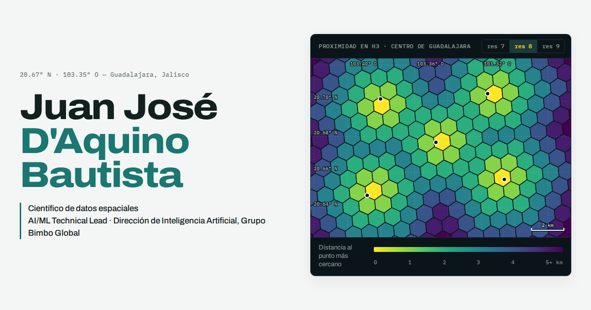

# Sitio personal: Juan José D'Aquino Bautista

Sitio estático (HTML, CSS y JavaScript, sin compilación ni dependencias que instalar) pensado
para publicarse gratis con GitHub Pages y enlazarse desde LinkedIn y otros perfiles.



## Qué tiene

| Sección | Contenido |
|---|---|
| Portada | Nombre, cargo y un **mapa H3 interactivo** del centro de Guadalajara: cada celda se colorea según la distancia (en anillos) al punto más cercano. Se cambia la resolución (7, 8, 9) y se agregan o quitan puntos con un clic. |
| Especialidad | Los métodos principales como leyenda de mapa. Sus símbolos se repiten en las etiquetas de los proyectos. |
| Proyectos | Galería con filtros por método: proximidad, H3, índice espacial, GeoPandas y curiosidades. |
| Trayectoria | Experiencia (Grupo Bimbo, Megacable) y formación (licenciatura, maestría, doctorado). |
| Contacto | LinkedIn, GitHub y correo. |

Respeta el tema claro u oscuro del sistema (con botón para cambiarlo), se adapta al celular y
trae las etiquetas Open Graph para que LinkedIn muestre la imagen `img/og.png` al compartir el enlace.

```
index.html              todo el texto del sitio
estilos.css             colores, tipografía y diseño
js/mapa-h3.js           el mapa de la portada (usa h3-js desde jsDelivr)
js/sitio.js             filtros de la galería, tema y aviso de pendientes
img/og.png              imagen para vista previa en redes (1200 × 630)
img/favicon.svg         icono de la pestaña
img/proyectos/          miniaturas de los proyectos (16:10)
```

## 1. Completar los datos pendientes

Todo lo que falta está marcado con `class="pendiente"`: se ve resaltado en ámbar y, mientras
quede alguno, arriba aparece un aviso con cuántos faltan. Para encontrarlos:

```bash
grep -n 'pendiente' index.html
```

Cuando completes un dato, borra el `<span class="pendiente">` que lo rodea (o quita la clase en
los enlaces). Al llegar a cero el aviso desaparece solo.

Lo que hay que llenar: años y descripción de cada puesto, programas e instituciones de tus
estudios, título de la tesis, tu URL de LinkedIn, el correo que quieras mostrar y los detalles y
enlaces de cada proyecto.

## 2. Verlo en tu computadora

Abre `index.html` con doble clic, o levanta un servidor local:

```bash
cd portafolio
python3 -m http.server 8000
# abre http://localhost:8000
```

## 3. Agregar o cambiar un proyecto

1. Copia un bloque `<article class="proyecto">…</article>` dentro de `<div class="galeria">`.
2. En `data-temas` pon los filtros donde debe aparecer, separados por espacios:
   `proximidad`, `h3`, `indice`, `geopandas`, `curiosidad`.
3. Guarda una captura en `img/proyectos/` (ideal 1280 × 800, proporción 16:10) y cambia `src`
   y `alt`. Las miniaturas actuales son ilustraciones de cada método; una captura real de tu mapa
   o notebook siempre será mejor.
4. En los enlaces pon tu notebook de Colab (compartido como "Cualquier persona con el enlace
   puede ver"), el repositorio o una demo.

Buena práctica: si el proyecto viene de tu trabajo, no publiques datos ni resultados internos.
Reproduce la metodología con datos abiertos (DENUE y Censo de INEGI, OpenStreetMap, datos de
gobierno abierto) y cuenta el impacto en términos generales.

## 4. Publicarlo con GitHub Pages

Lo recomendable es un repositorio propio para el sitio, así la dirección queda limpia:

1. En GitHub crea un repositorio público llamado exactamente **`jdxaquino.github.io`**.
2. Copia **el contenido** de esta carpeta (no la carpeta) a la raíz de ese repositorio y súbelo.
3. En el repositorio: **Settings → Pages → Build and deployment → Deploy from a branch**,
   rama `main`, carpeta `/ (root)`.
4. En uno o dos minutos queda en **https://jdxaquino.github.io/**.

El enlace "Jugar" del proyecto Juego de la Vida apunta a `https://jdxaquino.github.io/game-of-life/`.
Para que funcione, activa también GitHub Pages en el repositorio `game-of-life` (rama `master`,
carpeta `/docs`), como explica su README.

### Dominio propio (opcional)

Un dominio como `tunombre.com` o `tunombre.mx` cuesta entre 10 y 20 USD al año.

1. Cómpralo en cualquier registrador (Cloudflare, Namecheap, Porkbun, Akky para `.mx`…).
2. En **Settings → Pages → Custom domain** escribe el dominio y activa **Enforce HTTPS**.
3. En el DNS del registrador agrega cuatro registros `A` para el dominio raíz apuntando a
   `185.199.108.153`, `185.199.109.153`, `185.199.110.153` y `185.199.111.153`, y un registro
   `CNAME` para `www` apuntando a `jdxaquino.github.io`.
4. Cambia `og:url` y `og:image` en `index.html` a la nueva dirección.

## 5. Enlazarlo desde LinkedIn

- **Perfil → Información de contacto → Sitio web**: agrega la dirección y elige el tipo
  "Portafolio".
- **Sección Destacados → Agregar enlace**: aparece como tarjeta con la imagen `img/og.png`.
- Si LinkedIn muestra una vista previa vieja, pega la dirección en el
  [Post Inspector](https://www.linkedin.com/post-inspector/) para que la vuelva a leer.

Si cambias el diseño de la portada, reemplaza `img/og.png` por una captura nueva de 1200 × 630.

## Ideas para después

- Versión en inglés (`/en/`) para reclutadores internacionales.
- Una página por proyecto con el notebook completo. [Quarto](https://quarto.org) convierte
  notebooks `.ipynb` de Colab en páginas web, con los mapas de Folium interactivos, y publica
  en GitHub Pages.
- Publicaciones y tesis con enlace al PDF o al DOI.
- Tu CV en PDF: cópialo como `cv.pdf` y descomenta el botón en la portada.
